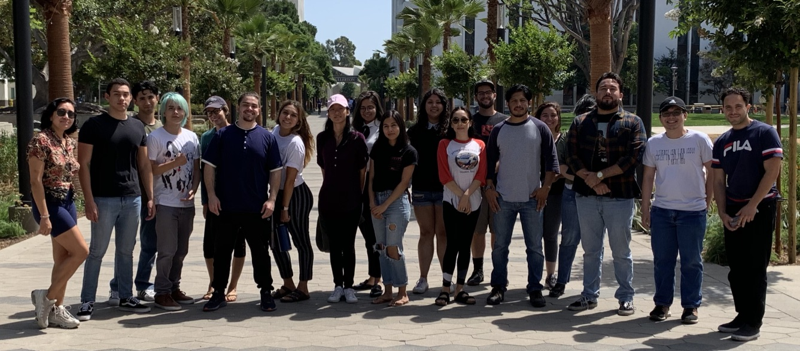

# 2019 Workshop on High-Performance Computing and Gravitational Waves

These are materials from the 2019 [Cal State
Fullerton](https://www.fullerton.edu) Workshop on High-Performance
Computing and Gravitational Waves. The workshop is scheduled to be held 
at Cal State Fullerton's [Gravitational-Wave Physics and Astronomy
Center](https://physics.fullerton.edu/gwpac), on August 19, 2019 -- August 23,
2019.

## Slides

* [Slides from 2019 Day 1](Workshop2019SlidesDay1.pdf)
* [Slides from 2019 Day 2](Workshop2019SlidesDay2.pdf)
* [Slides from 2019 Day 3](Workshop2019SlidesDay3.pdf)

## Slides from 2018

* [Slides from 2018](Workshop2018Slides.pdf)
* [Dr. Jocelyn Read's slides on gravitational waves from 2018](ReadWorkshop2018Slides.pdf)

## Cheat sheats

  * [Python Cheat Sheet by Eric Matthes](PythonCheatSheetMatthes.pdf)
  * [UNIX Cheat Sheet by FOSSWire](UnixCheatSheet.pdf)

## Links
  * [Notebook to explore data from SXS Catalog of simulations of merging black holes](https://mybinder.org/v2/gh/sxs-collaboration/catalog_tools/master?filepath=Examples%2Fsxs_bbh_example.ipynb) - This notebook will let you interact with data from different simulations in the SXS Catalog. It will show you how to make plots of the black-hole masses, and it will show you how to plot and turn into a sound the emitted gravitational waves.

  * [colab.research.google.com](https://colab.research.google.com) - Run Python notebooks on Google's supercomputers for free
  * [mybinder.org](https://mybinder.org) - Run Python notebooks that are already uploaded to [github.com](https://github.com) and also UNIX terminals for free
  * [notebooks.azure.com](https://notebooks.azure.com) - Run Python notebooks and UNIX terminals on Microsoft's supercomputers for free
  * [PyCBC Tutorials](https://github.com/gwastro/PyCBC-Tutorials) - Tutorials introducing gravitational-wave data analysis using Python notebooks
  * [LIGO Open Science Center](https://losc.ligo.org) - Learn about LIGO science, including playing with real LIGO data using python 
  * [ParaView](https://paraview.org) - Software to visualize 3D data

## Participants

The following students from [Citrus College](https://www.citruscollege.edu) 
are participating in the workshop:

* Alhasan Alobaidi
* Julia Cole
* Josephine Consengco
* Sherelene DeBelen
* Erick Delgdo
* Jason Diaz
* Erik Diaz
* Rebecca Gio
* Angel Gomez
* Carolyn Heredia
* Florencia Larraburu Lucia
* Daniel Martinez
* Marlo Morales
* An Nguyen
* Isaac Ortiz
* Marisol Pacheco
* Mark Rangel
* Robin Romero
* Sandra Serrano
* Aketzalli (Sally) Torres
* Alexandra Valencia
* Lisa Wang
