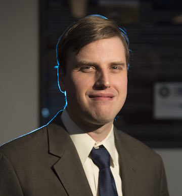

## About me

I am an associate professor in the [Department of Physics](http://physics.fullerton.edu/) at [California State University, Fullerton](http://www.fullerton.edu). My current research interests focus on using numerical relativity to model sources of gravitational waves, such as merging black holes. I join professors Jocelyn Read, Joshua Smith, and Al Agnew in Cal State Fullerton's [Gravitational Wave Physics and Astronomy Center (GWPAC)](http://physics.fullerton.edu/GWPAC/), and I also am a member of the [Simulating eXtreme Spacetimes (SXS) collaboration](http://www.black-holes.org/) and the [LIGO Scientific Collaboration](http://ligo.org/). 

[GWPAC](http://news.fullerton.edu/gravitational-waves/) and the SXS collaboration are contributing to [LIGO's discovery of gravitational waves](https://www.ligo.caltech.edu/news/ligo20160211).

## Research

At Cal State Fullerton, my research goals focus on modeling sources of gravitational waves using numerical relativity. Gravitational waves—ripples of spacetime curvature—are opening a new window on the universe. The Advanced Laser Interferometer Gravitational-wave Observatory (Advanced LIGO) has observed the [first gravitational waves](http://arxiv.org/abs/arXiv:1602.03837) passing through Earth, which came from merging black holes. My students and I use [supercomputers](http://physics.fullerton.edu/gwpac/news/highlights/172-orca-upgrade) to simulate colliding black holes using the [Spectral Einstein Code (SpEC)](http://black-holes.org/SpEC.html), and we are particularly interested in modeling  [merging black holes that spin nearly as fast as possible](http://arxiv.org/abs/arXiv:1412.1803) and in [responding to LIGO observations](http://arxiv.org/abs/arXiv:1607.05377). I recently have begun using supercomputers to [model thermal noise](https://arxiv.org/abs/1707.07774) in LIGO mirrors, with the goal of helping to improve the sensitivity of next-generation detectors, to explore [how well gravitatioanl-wave detectors can measure rapid black-hole spins](https://arxiv.org/abs/1804.03704), and to contribute to the development of [SpECTRE](http://github.com/sxs-collaboration/spectre), the SXS Collaboration's next-generation numerical-relativity code.

## Publications

My up-to-date publication list is available through [Google Scholar](https://scholar.google.com/citations?hl=en&user=NmbTrBEAAAAJ&view_op=list_works&sortby=pubdate) and [INSPIRES](https://inspirehep.net/author/profile/G.Lovelace.1).

## CV

You can download my [full CV](assets/CV.pdf).

